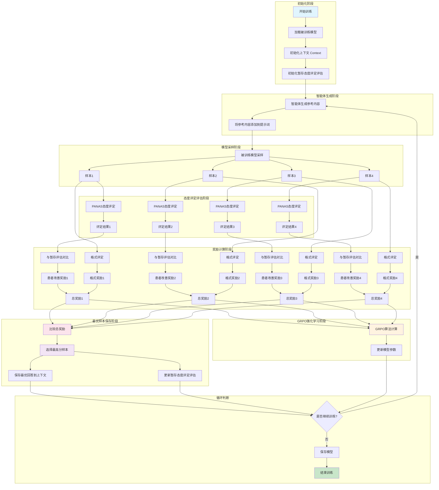
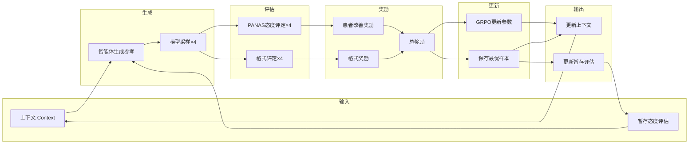

# GRPO 强化学习训练流程图

## 训练流程 Mermaid 图



## 简化版流程图



## 详细步骤说明

### 1. 初始化阶段
- 加载被训练模型
- 初始化上下文 Context
- 初始化暂存态度评定评估（上一轮的 PANAS 评分）

### 2. 智能体生成阶段
- 智能体生成参考内容
- 将参考内容添加到被训练模型的提示词中

### 3. 模型采样阶段
- 被训练模型采样 4 个样本
- 每个样本都是独立的输出

### 4. 态度评定评估阶段
- 对每个样本进行 PANAS 态度评定
- 输出 JSON 格式的评定结果

### 5. 奖励计算阶段
- **患者改善奖励**：当前评定与暂存评定对比
  - PA（积极情绪）增加 → 正奖励
  - NA（消极情绪）减少 → 正奖励
- **格式奖励**：检查输出格式是否正确
  - 格式正确 → 正奖励
  - 格式错误 → 负奖励或零奖励
- **总奖励** = 患者改善奖励 + 格式奖励

### 6. GRPO 强化学习阶段
- 使用 GRPO 算法计算梯度
- 更新模型参数

### 7. 最优样本保存阶段
- 比较 4 个样本的总奖励
- 选择最高分样本
- 保存最优回答到上下文
- 更新暂存态度评定评估（供下一轮使用）

### 8. 循环判断
- 判断是否继续训练
- 如果继续，返回智能体生成阶段
- 如果结束，保存模型

## 奖励函数设计

```python
def calculate_reward(current_panas, previous_panas, format_correct):
    # 患者改善奖励
    pa_improvement = current_panas['positive_affect']['total'] - previous_panas['positive_affect']['total']
    na_reduction = previous_panas['negative_affect']['total'] - current_panas['negative_affect']['total']
    
    patient_improvement_reward = pa_improvement * 0.5 + na_reduction * 0.5
    
    # 格式奖励
    format_reward = 1.0 if format_correct else -0.5
    
    # 总奖励
    total_reward = patient_improvement_reward + format_reward
    
    return total_reward
```

## 数据流示意

```
┌─────────────────────────────────────────────────────────────────┐
│                        第 N 轮训练                               │
├─────────────────────────────────────────────────────────────────┤
│                                                                  │
│  输入:                                                           │
│  - Context: [历史对话...]                                        │
│  - 暂存评估: {PA: 25, NA: 30}                                    │
│                                                                  │
│  智能体生成: "基于5Ps框架，建议询问..."                           │
│                                                                  │
│  模型采样:                                                        │
│  - 样本1: "你能告诉我更多关于..."                                 │
│  - 样本2: "我理解你的感受..."                                     │
│  - 样本3: "让我们来分析一下..."                                   │
│  - 样本4: "你觉得这个问题..."                                     │
│                                                                  │
│  态度评定:                                                        │
│  - 样本1: {PA: 27, NA: 28} → 改善奖励: +2.0                      │
│  - 样本2: {PA: 26, NA: 29} → 改善奖励: +1.0                      │
│  - 样本3: {PA: 28, NA: 27} → 改善奖励: +3.0                      │
│  - 样本4: {PA: 24, NA: 31} → 改善奖励: -1.0                      │
│                                                                  │
│  格式奖励:                                                        │
│  - 样本1: 格式正确 → +1.0                                        │
│  - 样本2: 格式正确 → +1.0                                        │
│  - 样本3: 格式正确 → +1.0                                        │
│  - 样本4: 格式错误 → -0.5                                        │
│                                                                  │
│  总奖励:                                                          │
│  - 样本1: 3.0                                                    │
│  - 样本2: 2.0                                                    │
│  - 样本3: 4.0 ← 最高分                                           │
│  - 样本4: -1.5                                                   │
│                                                                  │
│  输出:                                                           │
│  - 更新模型参数 (GRPO)                                           │
│  - 保存样本3到上下文                                             │
│  - 更新暂存评估: {PA: 28, NA: 27}                                │
│                                                                  │
└─────────────────────────────────────────────────────────────────┘
```

---

*文档创建时间: 2026-03-20*
